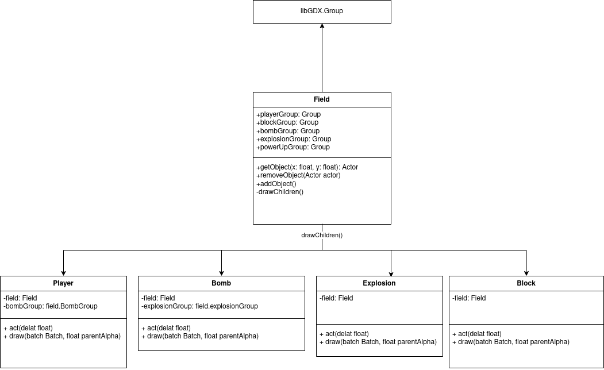

# 💣Bomberman - Team-Project💣

  
## Beschreibung
Dieses Projekt ist eine Implementierung des klassischen Arcade-Spiel Bomberman,
bei dem die Spieler durch ein Labyrinth navigieren, Bomben platzieren, um Hindernisse zu zerstören
und um Feinde zu besiegen.

## Workflow
Unser default Branch heißt "main". Dieser sollte immer "Compliefähig" sein. Deswegen wird für jede neue Implementierung ein neuer Branch eröffnet, auf welchem so lange gearbeitet wird,
bis die jeweilige Implementierung erfolgreich abgeschlossen ist. Darauf folgt eine Merge Request dieser 
fertigen Implementierung für "main". Sobald der Code reviewed wurde, wird die Merge Request akzeptiert.

## Installation

### Manuelle Ausführung
1. Klonen des repository
2. (Falls Gradle nicht schon installiert ist) Die Datei "gradlew" auf Unixodien bzw. "gradlew.bat" auf Windows ausführen,
um die passende Gradle-Version herunterzuladen.
3. Mit der Kommandozeile in den Ordner "desktop" navigieren.
4. Den befehl ```gradle run``` ausführen.

### Auführung über Intellij
1. Klonen des repository
2. Gradle über Intellij herunterladen. Meistens ist Gradle aber schon installiert.
3. Mit der Kommandozeile in den Ordner "desktop" navigieren.
4. Den befehl ```gradle run``` mit Strg+Enter ausführen.

## Aufbau des Spiels


Im obigen Bild sieht man den Aufbau des Spiels. Dieses Bild wird stetig geupdatet damit es immer auf einem aktuellen Stand ist. Die Klasse ```Field``` erbt von [libGDX.Group](<https://javadoc.io/static/com.badlogicgames.gdx/gdx/1.12.1/com/badlogic/gdx/scenes/scene2d/Group.html>) und die einzelnen Objekte von der Klasse [libGDX.Actor](<https://javadoc.io/static/com.badlogicgames.gdx/gdx/1.12.1/com/badlogic/gdx/scenes/scene2d/Actor.html>). Dies ermöglicht uns viele Sachen zu vereinfachen. Dazu einige Beispiel:

* die Methode ```act(float delta)``` wird automatisch bei jedem Frame aufgerufen. (Siehe dazu [act(float delta)](<https://javadoc.io/static/com.badlogicgames.gdx/gdx/1.12.1/com/badlogic/gdx/scenes/scene2d/Actor.html#act(float)>))
* die Methode ```draw(Batch batch, float parentAlpha)``` lässt sich Überschreiben einfach überschreiben. (Siehe dazu [draw(Batch batch, float parentAlpha)](<https://javadoc.io/static/com.badlogicgames.gdx/gdx/1.12.1/com/badlogic/gdx/scenes/scene2d/Actor.html#draw(com.badlogic.gdx.graphics.g2d.Batch,float)>))
* die Methode ```drawChildren()``` ruft automatisch ```draw(Batch batch, float parentAlpha)``` eines jeden Child auf.

Da das Grundgerüst nun steht und alle Grundfunktionalitäten bereits implementiert sind, sollte nurch noch in Ausnahmefällen, etwas am Code von den obigen Klassen verändert werden. Um die Objekte auf dem Spielfeld zu verwalten gibt es die Klasse ```Field```. Diese besitzt auch, durch die Methoden ```getObject(float x, float y)```, ```removeObject(Actor actor)``` und ```addObject(Actor actor)```, eine Schnittstelle. Dazu ein Beispiel:

Will man einen ```Block``` vom Spielfeld entfernen, so schreibt man ganz einfach
```java
Block block = new Block(BlockType.UNDESTROYABLE, x, y);
field.addObject(block);
field.removeObject(block);
field.removeObject(field.getObject(x,y));
```

!!!Die Zeiger auf einzelne ```Groups``` von ```Field```, in den obigen Klassen sollten nicht verwendet werden, da dieser Zeiger bald entfernt wird. Eine bessere Alternative bieten die Funktionen ```getObject(float x, float y)```, ```removeObject(Actor actor)``` und ```addObject(Actor actor)```!!!


## Verwendete Tools
* Programmiersprache: Java (<https://www.oracle.com/de/java/>)
* GUI-Toolkit: libGDX (<https://libgdx.com/>)
* Diagramm-Editor: Visual Paradigm Online (<https://online.visual-paradigm.com/de/login.jsp>)
* Projektmanagement-/Planungs-Tool: Jira Software (<https://www.atlassian.com/de/software/jira>)
* GUI-Prototyping: Figma (<https://www.figma.com/de/>)
* Versionsverwaltung: GitLab (<https://git.uni-wuppertal.de/2118411/team-bomberman-no.1>)
* Entwicklungsumgebung: IntelliJ IDEA (<https://www.jetbrains.com/de-de/idea/>)
* IntelliJ-Plugin: Prettier (<https://plugins.jetbrains.com/plugin/10456-prettier>)
* Coding Style Guides: (<https://google.github.io/styleguide/javaguide.html>)

## Roadmap:
- [x] Hit-Detectsion
- [x] Sudden-Death
- [x] Bomben
- [x] Power-Ups
- [x] Zerstörbare Objekte
- [x] Spieler Ausscheidung
- [x] Timer zum Spielbeginn
- [x] Gewinn
- [x] Spieler Austritt
- [x] Optimierungen
